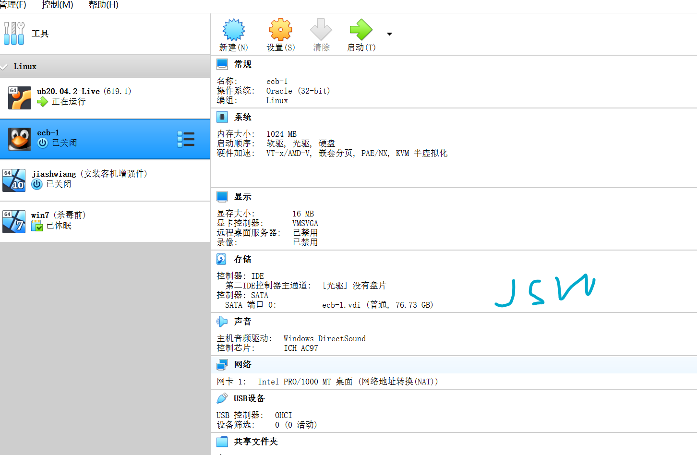
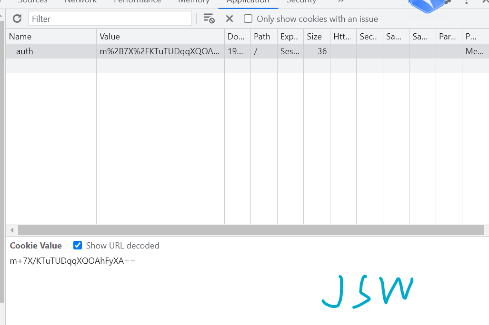
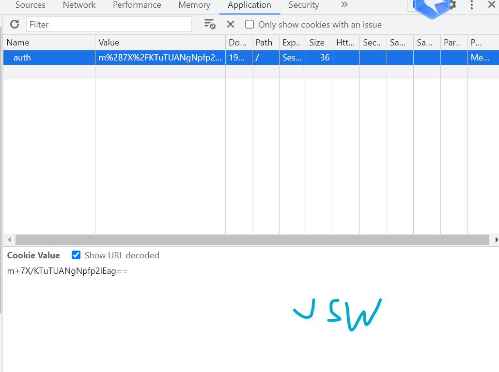
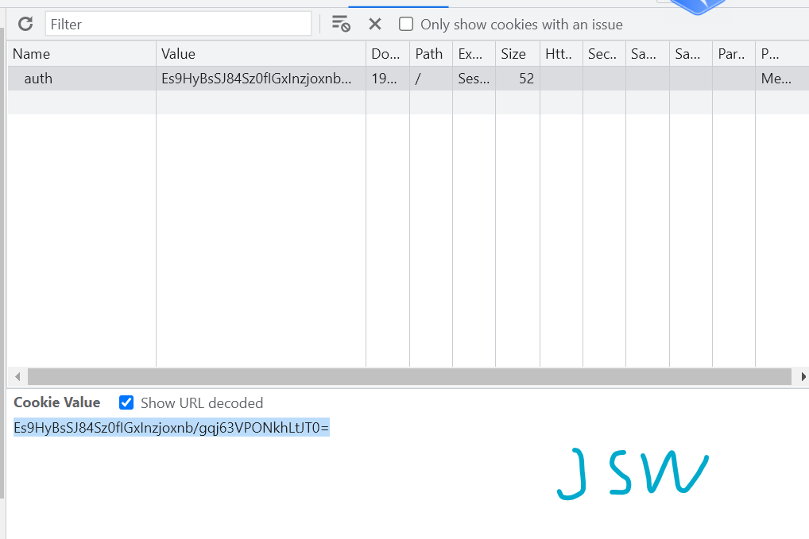
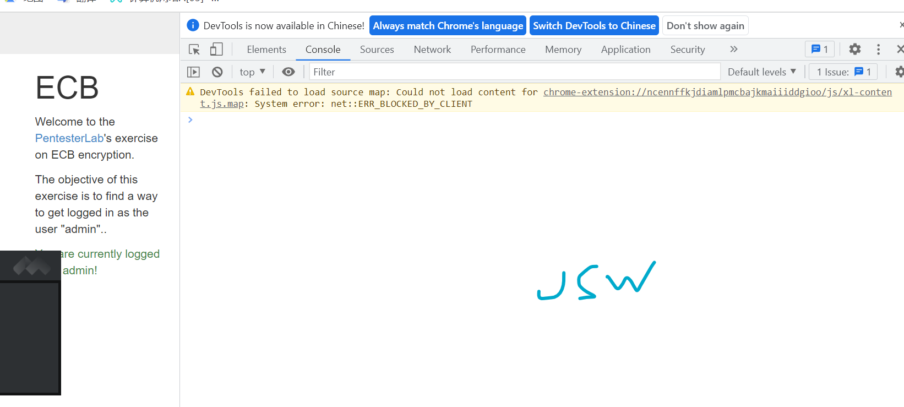
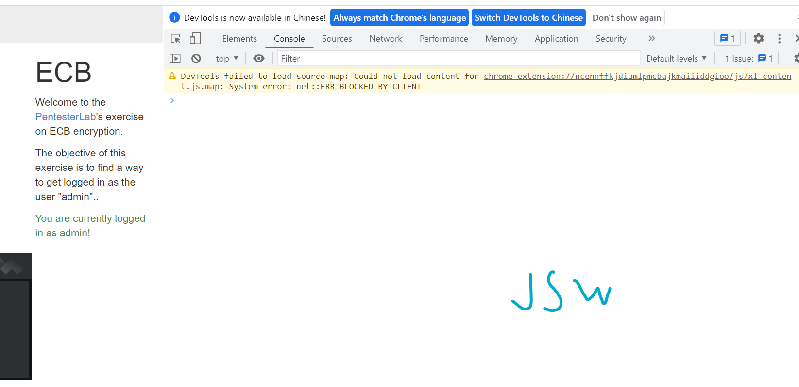
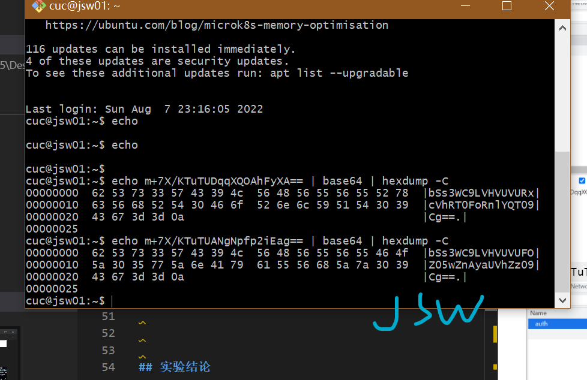
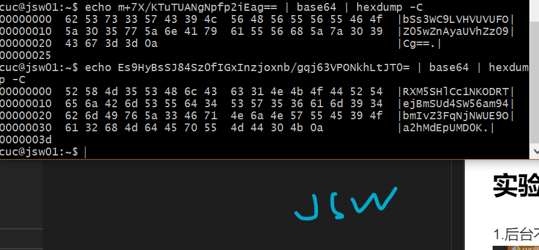
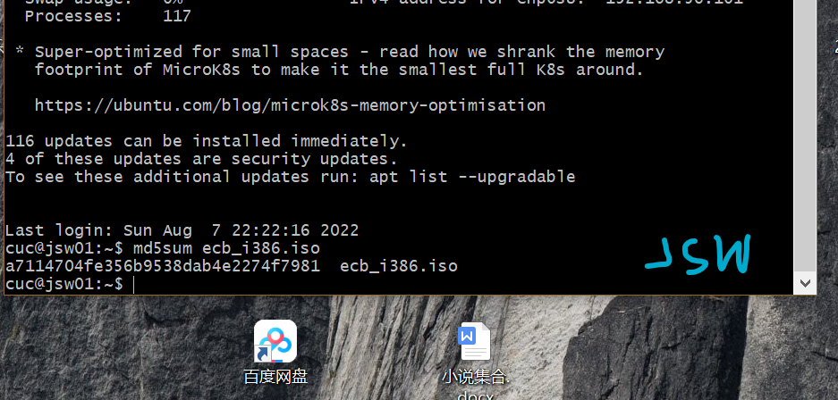

# Electronic Code Book (ECB)

## 实验环境

`Ubuntu 20.04`

`Vscode remote`

## 实验原理

### ECB：

ECB模式全称是Electronic CodeBook模式，在ECB模式中，将明文分组加密之后的结果将直接成为密文分组。

#### 优点

1. 操作简单，易于实现
2. 分组的独立性，利于实现并行处理，并且能很好地防止误差传播。

#### 缺点

1. 所有分组的加密方式一致，明文中的重复内容会在密文中有所体现，因此难以抵抗统计分析攻击。
2. 一般只适用于小数据量的字符信息的安全性保护，例如密钥保护。

### 分组重放

1. `ECB` 模式最严重的问题是允许选取部分分组进行重放攻击
2. 特别是针对按分组格式化的数据
3. 必须辅助以消息认证来保证完整性

## 实验过程

### 搭建环境

### 实验

1. 创建2个名称相似的用户：测试1和测试2以及相同的密码，然后查看应用程序发送回的cookie

`cookie`后8个字节相同

密码：1234

`m+7X/KTuTUDqqXQOAhFyXA==`

`m+7X/KTuTUANgNpfp2iEag==`

2. 创建一个由相同字符组成的真正长名的用户(比如20次a)，然后查看应用程序发送回的cookie

`Es9HyBsSJ84Sz0fIGxInzjoxnb/gqj63VPONkhLtJT0=`
* 20个w组成的用户名

3. 创建用户，以管理员身份登录

`Es9HyBsSJ86YMhBvxnBx5NzeOcWihy/G`

返回的cookie
`mDIQb8ZwceTc3jnFoocvxg==`

4. 创建用户，登录作为管理员交换加密块

`mNFTiQxWSWy1BlFFazd3eshx6uXNvSnx`

返回的cookie
`yHHq5c29KfG1BlFFazd3epjRU4kMVkls`

## 实验结论

1. 后台不对密码部分进行验证

2. 8个字节重复出现

3. 加密消息的块可以移动，不会干扰解密过程。

## 实验反思
1. 下载一个包之后，可以通过计算校验和的方式验证包是否完整。

2. 新建虚拟机时可以使用双网卡。
3. cookie容易获取，控制台上也可以修改。
4. 解码时在 `base64`后应该加 `-d`，否则解码结果会多次不一样。
5. 修改cookie后刷新网页即可，无需重新登陆。
6. 建立好虚拟机然后打开相应网页后，在操作过程中不应关闭虚拟机，否则会出现网页打开失败的状况。

## 参考文献

1.[单兵作战实验环境搭建](http://courses.cuc.edu.cn/course/87823/learning-activity/full-screen#/368311)

2.[Electronic Code Book](https://pentesterlab.com/exercises/ecb/attachments)

3.[ECB模式](https://baike.baidu.com/item/ECB%E6%A8%A1%E5%BC%8F/2670763)
